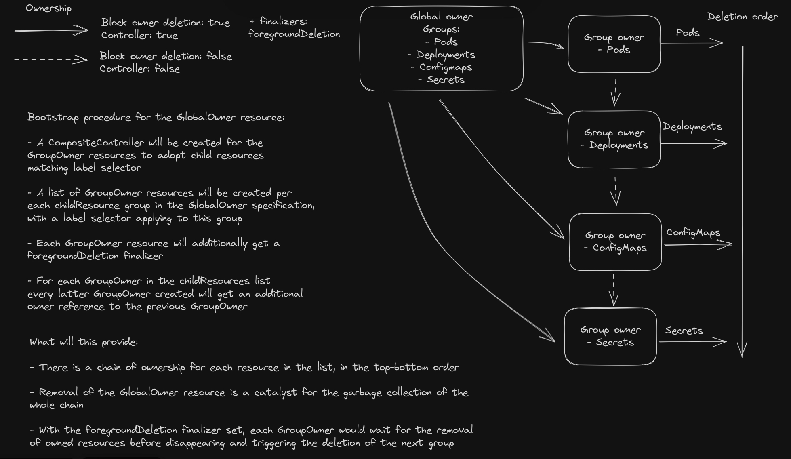

# Ordered Deletion

Resources deletion is processed in the order specified on the `GlobalOwner` resource.

### Blockers

Unfortunately this design does not work, because of an issue in the garbage collector implementation: <https://github.com/kubernetes/kubernetes/issues/121113>. Until it is fixed, this is just a concept.

## Deletion

As the resource is adopted using owner reference to the parent object, when the parent object is removed using foreground or background policy, the adopted resource will be removed as well. To opt out of this behavior, the metacontroller instance should be scaled down, the finalizer `metacontroller.io/compositecontroller-<global-owner-name>` should be removed from the resource, and then the `GlobalOwner` resource can be deleted with the `orphan` deletion policy. Adopted resources will stay untouched, however, the `CompositeController` and the `ClusterRole` created by the `GlobalOwner` resource will stay in the cluster, so the permission scope will not be reduced. Those will have to be cleaned up manually.
